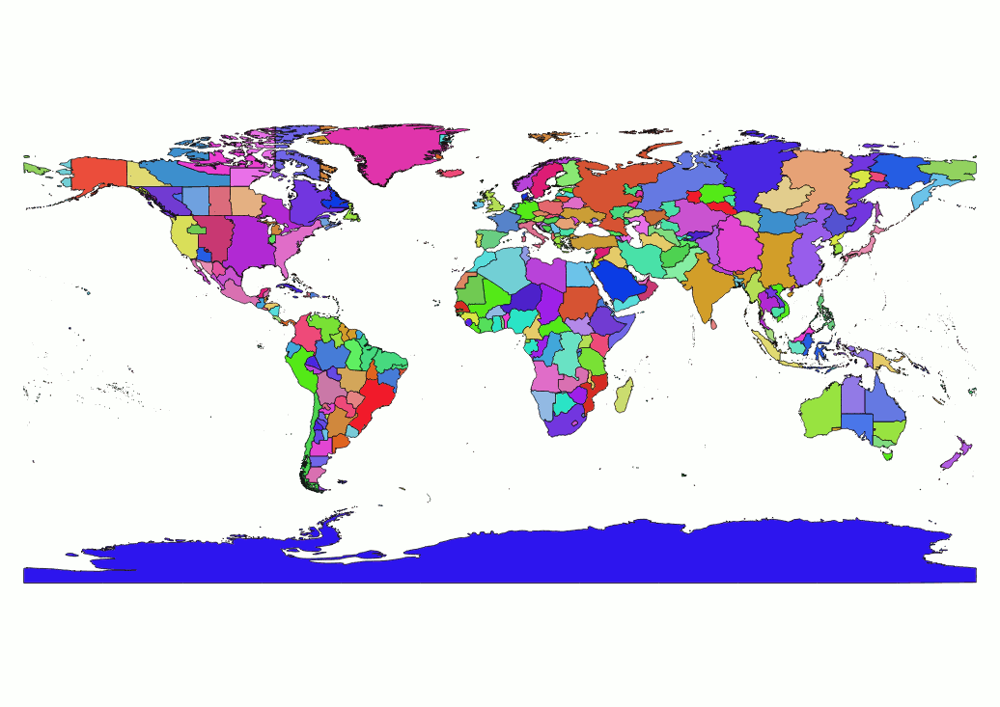
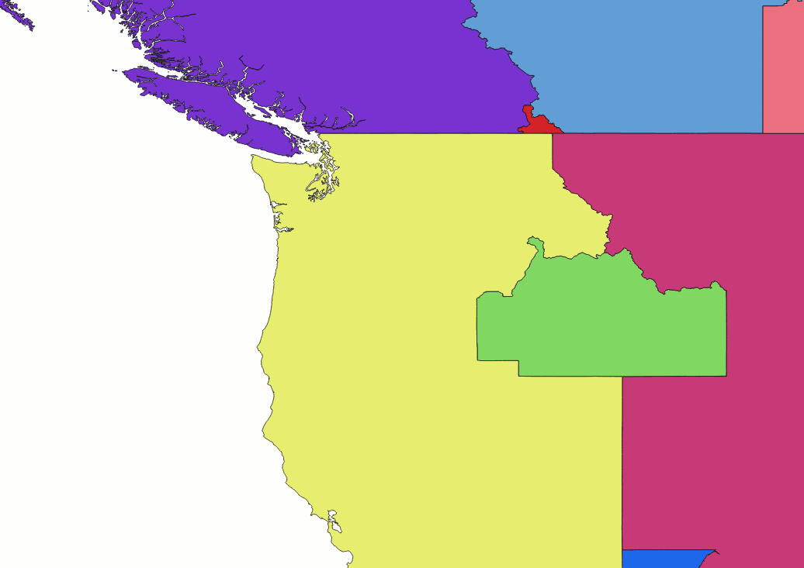
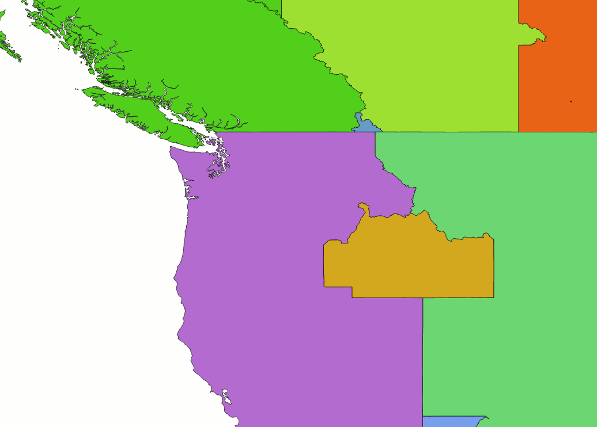
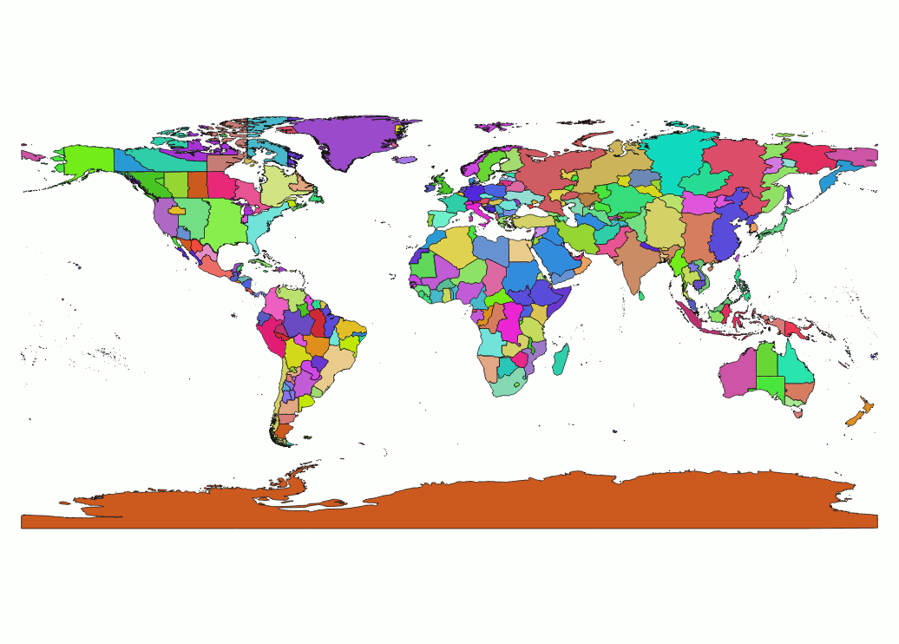

# Shapefile Geo#

Shapefile-Geo is a set of utilities to reduce the size of a Shapefile and quickly access an in-memory representation of it with respect to an property of interest.

At Foursquare, we use it to quickly retrieve the timezone of a latitude and longitude: timezone reverse geocoding.  A version of this utility is also a component in the Foursquare [twofishes](ttps://github.com/foursquare/twofishes) geocoder.

This is a Java port of the original Scala code written in 2011, in hopes that it will be more useful to others.


## Usage ##
```
usage: com.foursquare.geo.shapes.ShapefileSimplifier original.shp
                                                     simplified.shp
                                                     label-attr
 -d,--debug                        Show debug output.
 -h,--help                         Show this message.
    --level-sizes                  Comma-separated branching factor of
                                   grid per level. Default is 40,2,2,2.
    --no-geometry-simplification   Skips simplification features to
                                   rectangle when a cell has features of
                                   only one label.
    --water-triangularization      Reduces coastline complexity when a
                                   cell has  features with more than one
                                   label.
```

## Example ##
Here is how one might use this utility for timzone reverse geocoding.

1. Find a Shapefile containing timezone data, like [http://efele.net/maps/tz/world/](http://efele.net/maps/tz/world/).

  ```
  curl -LO http://efele.net/maps/tz/world/tz_world.zip
  unzip tz_world.zip
  ```
2. Use the the utility to simplfy the information.  It will divide the map into little rectangular cells.  If all of the features (shapes) in a indexedValues have the same property value (we'll use the `TZID` value), all the shapes within that indexedValues will just be replaced with a simple rectangle.  Water has no `TZID` value, so many coastlines will be simplified away.

  ```
  ./compileAndRun com.foursquare.geo.shapes.ShapefileSimplifier world/tz_world.shp tz_world_simplified.shp TZID
  ```
  The first parameter is main method of the simplifier.  The next is the source we just unzipped, then the destination, and finally the property of interest, `TZID`.  THe output is itself a valid shapefile, so you can take a look with a tool like [QGIS](http://www.qgis.org/en/site/):
  
  The borders between different timezones are preserved with their original detail.  In cells where the timezones are the same, or there is only one timezone, the detail has been removed.

3. We'll load this new Shapefile into the memory of our server.  An example server with a commandline interface is provided so you experiment.

  ```
  ./compileAndRun com.foursquare.geo.shapes.example.SimplifiedShapefileClient tz_world_simplified.shp TZID
  lat,long> 40.74, -74.0
  America/New_York
  ```
  We can test a more complicated timezone boundary snaking through Kentucky:
  

 ```
  lat,long> 36.182, -84.900
  America/New_York
  lat,long> 36.182, -84.910
  America/Chicago
  ```

4. One issue with the basic simplification routine is that it doesn't simplify costal shapes with different labels that reside within the same cell.  An example is evident between the US-Canadian border in the northwest corner of Washington state:
  

 Another simplification pass can help correct the unnecessarily complex border geometry that persists at these coastal boundaries by using a Delaunay Triangulation to estimate a line that divides the features within the cell based on label:
   

This simplification pass takes longer, but may be worth it if your application frequently reverse geocodes points near coastal boundaries.  It is enabled by passing `--water-triangularization` to the simplification command above.  As a nice side-effect, the pass also results in slightly more precise cell coverings for island features:
  
